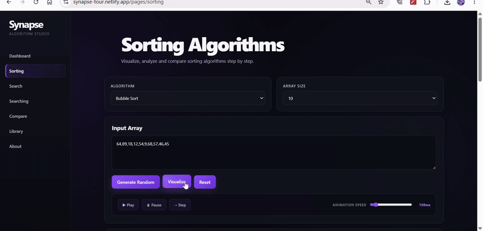
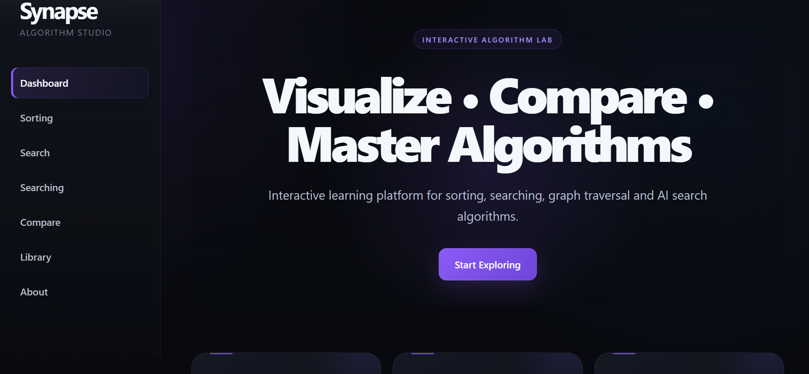
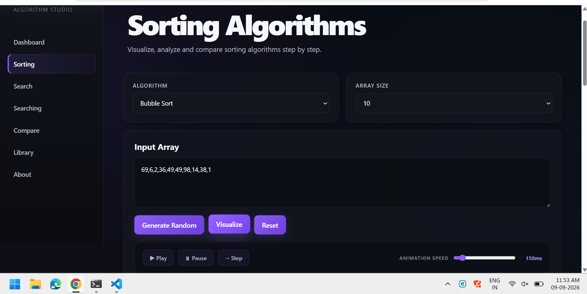
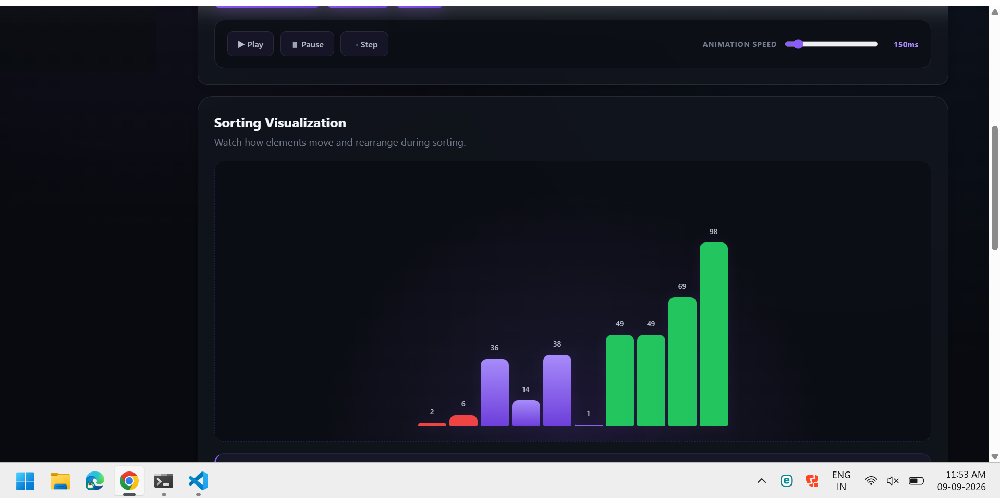
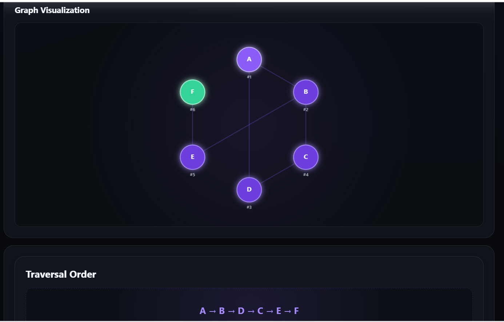
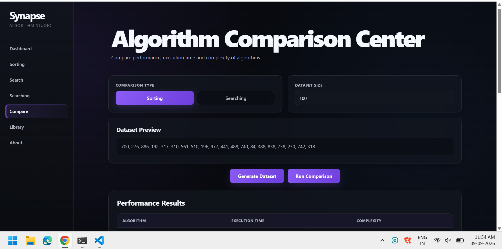

# 🧠 Synapse — Interactive Algorithm Studio

> **Understand → Visualize → Experiment → Compare**

An interactive space to understand algorithms, visualize their behavior, and explore how they work.

[](https://synapse-tour.netlify.app/)
[](https://github.com/luffy-loop/Synapse_Studio)
[](https://github.com/luffy-loop/Synapse_Studio/actions/workflows/validate.yml)

---

## Overview

Synapse is a browser-based algorithm exploration platform built to make core computer science algorithms easier to understand through interaction and visualization.

Instead of only reading about an algorithm, users can experiment with it, observe how it behaves step by step, compare algorithms, and explore their time and space complexity.

---
## ✨ Highlights

- 🎨 Modern dark UI designed for algorithm exploration
- 📊 Interactive sorting visualizations
- 🔎 Linear and Binary Search exploration
- 🕸️ Canvas-based graph visualization
- ⚡ BFS, DFS, Uniform Cost Search, Greedy Search, and A*
- 📈 Algorithm performance comparison
- 🎮 Play, pause, and step-based visualization controls
- 📚 Built-in algorithm reference library
- 📱 Responsive interface
- 🚀 Deployed with Netlify
## ?? Screenshots

## ?? Demo



### Dashboard

The main workspace provides access to Synapse's interactive algorithm labs and learning tools.



### Sorting Lab

The sorting section provides access to interactive sorting algorithms and visualization controls.



### Sorting Visualization

Experiment with sorting algorithms using custom inputs, playback controls, animation speed, and step-by-step visualization.



### Graph Search

Explore graph traversal visually and observe node exploration and traversal order.



### Algorithm Comparison

Generate datasets and compare algorithm execution behavior, performance, and complexity.


---

## Features

- **Sorting Lab** — Visualize Bubble, Selection, Insertion, Merge, and Quick Sort.
- **Searching Lab** — Experiment with Linear and Binary Search.
- **Graph Search** — Explore graph traversal and path-search behavior visually.
- **Algorithm Comparison** — Compare algorithm performance on generated datasets.
- **Algorithm Library** — Browse definitions, complexity, advantages, disadvantages, and applications.
- **Interactive Visualizations** — Observe algorithm operations through animated visual feedback.
- **Playback Controls** — Play, pause, adjust animation speed, and step through sorting visualizations.
- **Complexity Analysis** — Understand how algorithm performance changes with input size.
- **Responsive Interface** — Designed for desktop and smaller screens.

---

## Algorithm Coverage

| Category | Algorithms |
|---|---|
| **Sorting** | Bubble Sort, Selection Sort, Insertion Sort, Merge Sort, Quick Sort |
| **Graph Search** | BFS, DFS, Uniform Cost Search, Greedy Search, A* |
| **Searching** | Linear Search, Binary Search |

---

## Tech Stack

| Technology | Purpose |
|---|---|
| **HTML5** | Page structure and semantic content |
| **CSS3** | Responsive layouts, visual system, animations, and effects |
| **JavaScript** | Algorithm implementations, visualization logic, interaction, and state management |
| **Canvas API** | Graph visualization |
| **Netlify** | Deployment |

No framework is required.

Synapse is intentionally built with vanilla HTML, CSS, and JavaScript to keep the algorithm implementations visible and understandable.

---

## What This Project Demonstrates

- Algorithm implementation using vanilla JavaScript
- Step-by-step algorithm visualization
- Interactive animation and playback controls
- Canvas-based graph visualization
- Client-side state and interaction management
- Algorithm complexity analysis
- Dataset generation and performance comparison
- Responsive frontend development
- Modular HTML, CSS, and JavaScript organization

---

## Project Structure

```text
Synapse_Studio/
├── assets/              # Visual assets
├── css/                 # Styles
├── js/                  # Algorithms and application logic
├── pages/               # Application pages
├── docs/
│   └── screenshots/     # README screenshots
├── index.html           # Dashboard
└── README.md            # Documentation
```

---

## Application Sections

### Dashboard

The main entry point to Synapse, introducing the platform and its interactive algorithm labs.

### Sorting

Visualize sorting algorithms and observe how elements are compared, swapped, and rearranged.

### Search

Explore graph-based search concepts with an interactive graph visualization.

### Searching

Experiment with Linear Search and Binary Search using animated array visualizations.

### Compare

Run algorithm comparisons against generated datasets and inspect execution results and complexity information.

### Library

Use the built-in reference library to explore algorithm definitions, complexity, applications, advantages, and limitations.

### About

Learn about the motivation, scope, and implementation of Synapse.

---

## Running Locally

Synapse is a static web application, so no package manager or build step is required.

### 1. Clone the repository

```bash
git clone https://github.com/luffy-loop/Synapse_Studio.git
```

### 2. Open the project

```bash
cd Synapse_Studio
```

### 3. Run the application

Open `index.html` directly in a browser.

For the best development experience, use a local development server such as **VS Code Live Server**.

---

## Why Synapse?

Algorithmic concepts are often taught through static diagrams, pseudocode, and theoretical complexity tables.

Synapse takes a more interactive approach:

> **Understand → Visualize → Experiment → Compare**

The goal is to make algorithm behavior easier to observe rather than treating algorithms as code that only runs in the background.

---

## Project Context

Synapse was developed as an academic project for **Computational Foundations of Artificial Intelligence (CFAI)**, with a focus on making algorithmic concepts more interactive and approachable.

---

## Future Improvements

Planned improvements include:

- Richer algorithm playback and step controls
- Additional visualization modes
- Improved mobile interactions
- Deeper performance analytics
- Expanded algorithm coverage
- Accessibility improvements
- Automated testing

---

## Author

**Kandhula Poojasri Reddy**

Computer Science Student · Developer · ML Explorer

---

⭐ If you find Synapse useful for learning algorithms, consider giving the repository a star.

